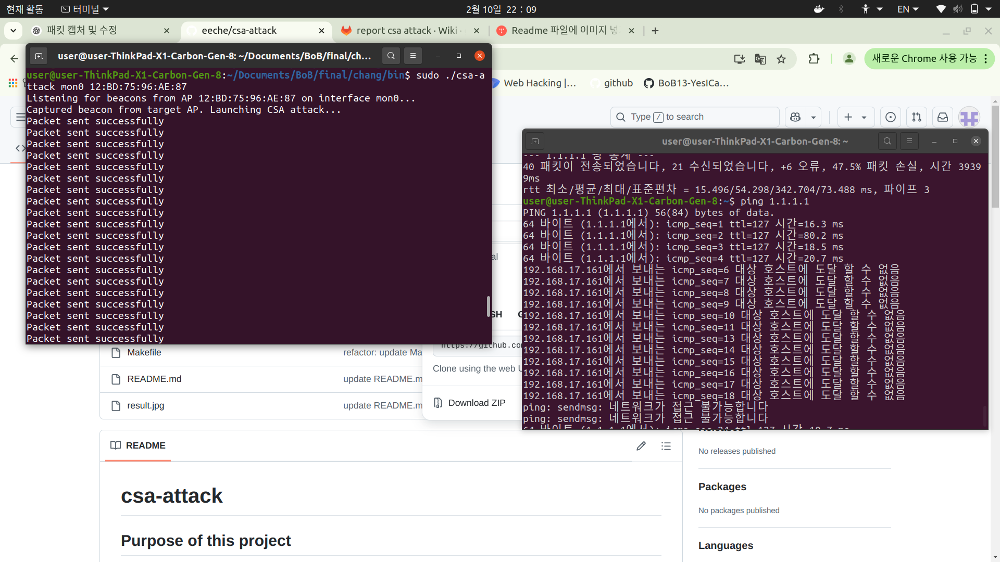

# csa-attack

## Purpose of this project 
This tool manipulates WiFi network beacon frames to perform a channel switch attack. It captures beacon frames of a specific WiFi Access Point (AP) and injects a Channel Switch Announcement (CSA) Information Element (IE) to force clients to move to a different channel.

## How to build

```bash
make
```

## How to use the code
```bash
syntax : csa-attack <interface> <ap mac> [<station mac>]
sample : csa-attack mon0 01:23:45:67:89:AB 01:23:45:67:89:AB
```

## Result

