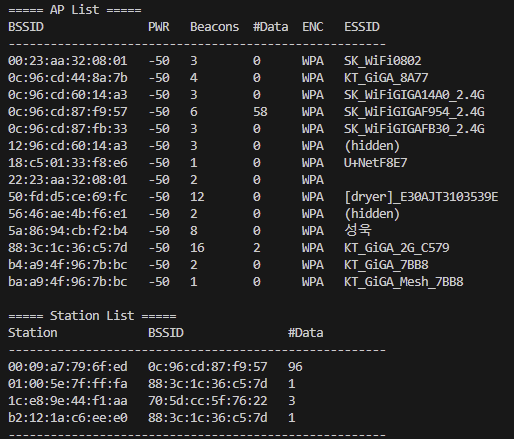

# airodump

## Purpose of this project  
This tool is a lightweight network monitoring utility similar to `airodump-ng`, designed to capture and analyze WiFi packets in monitor mode. It scans for nearby WiFi Access Points (APs) and connected stations, displaying real-time information such as BSSID, signal strength (PWR), encryption type, and associated clients. The tool uses the `libpcap` library for packet capture and implements automatic channel hopping to ensure comprehensive scanning across multiple channels. It is useful for network security analysis, penetration testing, and wireless network troubleshooting.

## Prerequisites  
To use this tool, a wireless network environment is required, and the network interface must be set to monitor mode.  
For testing purposes, you need to set up a wireless network using an 802.11n wireless adapter. To enable monitor mode on the network interface, execute the following commands:  
```bash
# Check available wireless interfaces
iwconfig  

# Enable monitor mode
sudo ip link set <interface> down  
sudo iw dev <interface> set type monitor  
sudo ip link set <interface> up  
```

## How to build

```bash
make
```

## How to use the code
```bash
syntax : airodump <interface>
sample : airodump mon0
```

## Result
