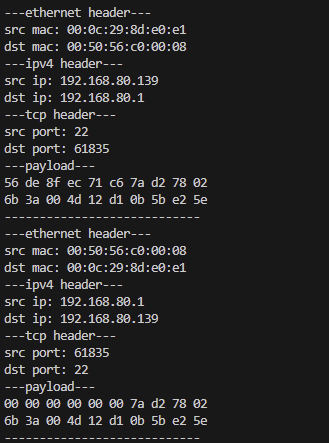

# pcap-test

## Purpose of this project  
This tool captures and analyzes network packets using the `libpcap` library. It extracts key information from Ethernet, IPv4, and TCP headers, displaying details such as source/destination MAC addresses, IP addresses, port numbers, and the first 20 bytes of the payload. This tool is useful for network traffic analysis, debugging, and educational purposes related to packet structure and network protocols.

## How to build

```bash
make
```

## How to use the code
```bash
syntax: pcap-test <interface>
sample: pcap-test wlan0
```

## Result
